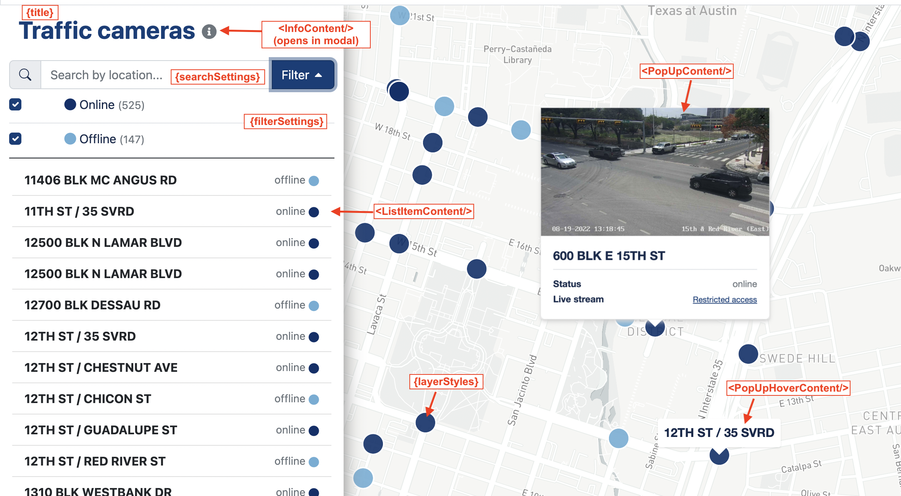

# ATD Data & Performance Hub <!-- omit in toc -->

This repo houses code for the [ATD Data & Performance Hub](https://data.mobility.austin.gov/). It is a [NextJS](https://nextjs.org/) app that relies heavily on [open data APIs](https://data.austintexas.gov/).

## Contents <!-- omit in toc -->

- [Get it running](#get-it-running)
- [Configuring a new `MapList`](#configuring-a-new-maplist)
  - [Props overview](#props-overview)

## Get it running

Activate your node environment

```shell
$ nvm use
```

Install dependencies

```shell
$ npm install
```

Start the development server

```shell
$ npm run dev
```

Open [http://localhost:3000](http://localhost:3000) with your browser to see the result.

You can start editing the page by modifying `pages/index.js`. The page auto-updates as you edit the file.

## Configuring a new `MapList`

The `MapList` is a configureable dashboard component that provides a linked list and map view. It is designed to work well on mobile/touch devices, and can be customized to many data display needs.

### Props overview

See `components/MapList.js` for complete props documentation. The `MapList` can be constructed like so:

```javascript
<MapList
  filterSettings={FILTER_SETTINGS}
  getMapIcon={getMapIcon}
  geojson={geojson}
  error={error}
  featurePk="signal_id"
  loading={loading}
  ListItemContent={ListItemContent}
  InfoContent={InfoContent}
  layerStyles={LAYER_STYLES}
  PopUpContent={PopUpContent}
  PopUpHoverContent={PopUpHoverContent}
  searchSettings={SEARCH_SETTINGS}
  title="Signal monitor"
/>
```

This image illustrates how these props affect the layout:

